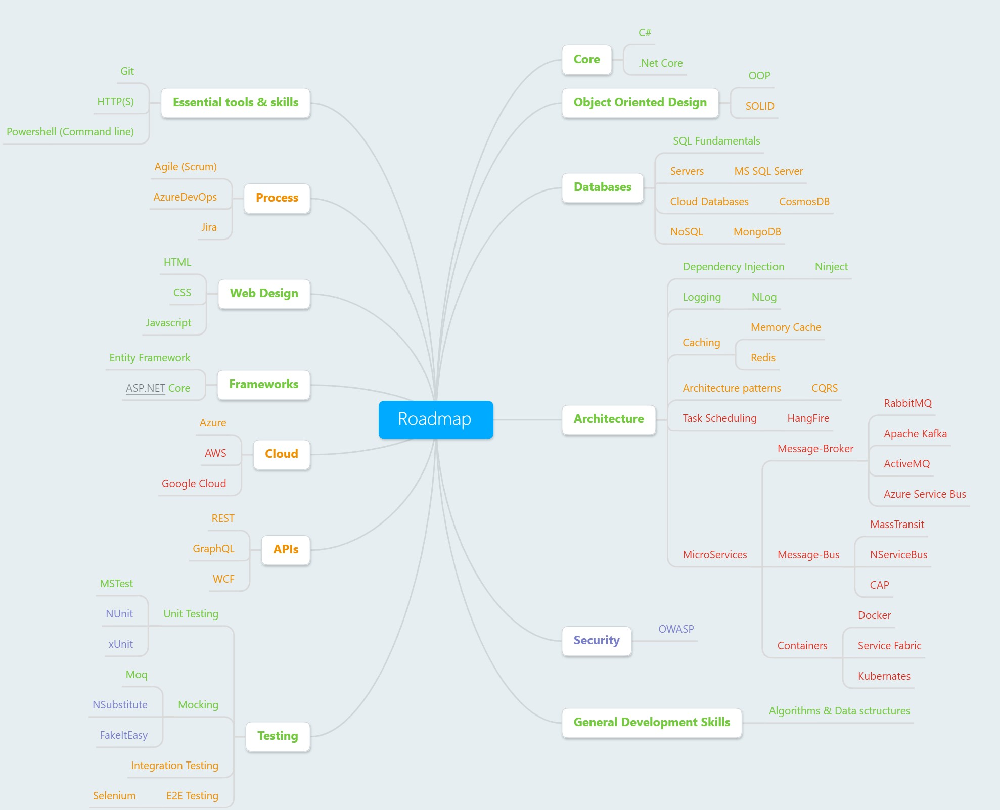

# Mind map

# Legend  

[&#9733;] [Basics](./ReadMe.easy.md)   
[&#9733;&#9733;] [Moderate]       
[&#9733;&#9733;&#9733;] [Advanced]   
[&#9734;] Optional  

# Roadmap
## Core 

1. C#  
    > *Official site* <https://docs.microsoft.com/en-us/dotnet/csharp>  [&#9733;]  
    > *Pluralsight Learning Path* <https://www.pluralsight.com/paths/csharp> [&#9733;-&#9733;&#9733;&#9733;]  
    > *Book* [C# in depth](https://www.manning.com/books/c-sharp-in-depth-third-edition) [&#9733;&#9733;]  
       
2. .Net Core
    > *Playground* <https://dotnet.microsoft.com/learn/dotnet/in-browser-tutorial/1>  [&#9733;]

## Object Oriented Design
1. OOP 
    > *Web* <https://www.dotnetcurry.com/software-gardening/1125/object-oriented-programming-oops>

1. Design Patterns 
    > *Book* [Патерни - Просто як дверi](http://designpatterns.andriybuday.com) [&#9733;&#9733;]  
    > *Web* <https://www.dofactory.com/net/design-patterns> [&#9733;&#9733;]  

1. SOLID 
    > *Wiki* <https://en.wikipedia.org/wiki/SOLID>

## Databases

### SQL Fundamentals 
> recources to be added 

### Servers
1. MS SQL Server
    > *Web* <https://www.microsoft.com/sql-server/sql-server-2017>      

### Cloud Databases
1. CosmosDB 
    > *Web* <https://docs.microsoft.com/azure/cosmos-db>

### NoSQL
1. MongoDB
    > *Web* <https://docs.microsoft.com/aspnet/core/tutorials/first-mongo-app> 
1. Redis   
    > *Web* <https://redis.io/>  

## Essential knowledge 
1. Git 
    > *Web* <https://git-scm.com/> [&#9733;]  
    > *Book* [Pro Git](https://books.google.com.ua/books?id=jVYnCgAAQBAJ) [&#9733;]
1. HTTP(S)
    > *Wiki* <https://en.wikipedia.org/wiki/HTTPS>
1. Powershell (Command line)
    > *Web* <https://microsoft.com/powershell>  
    
    
    
## Security
1. OWASP 
    > *Top 10* <https://owasp.org/www-project-top-ten/> [&#9733;&#9733;]

## Frameworks
1. Entity Framework 
    > [Pluralsight](https://www.pluralsight.com/search?q=entity%20framework%20core)
1. ASP.NET Core  
    > [Pluralsight](https://www.pluralsight.com/search?q=asp.net%20core)         

    
## Architecture

### Architecture patterns
1.  [CQRS](https://docs.microsoft.com/azure/architecture/patterns/cqrs) 

### Dependency Injection
1. [Ninject](http://www.ninject.org/)   

### Caching
1. [Memory Cache](https://docs.microsoft.com/aspnet/core/performance/caching/memory)
1. [Redis](https://redis.io/)

## Task Scheduling
1. [HangFire](https://github.com/HangfireIO/Hangfire)
1. [Coravel](https://github.com/jamesmh/coravel)
1. [Fluent Scheduler](https://github.com/fluentscheduler/FluentScheduler)

### Logging
1. [NLog](https://github.com/NLog/NLog)  

## MicroServices

### Message-Broker
1. [RabbitMQ](https://www.rabbitmq.com/tutorials/tutorial-one-dotnet.html)
1. [Apache Kafka](https://github.com/confluentinc/confluent-kafka-dotnet)
1. [ActiveMQ](https://github.com/apache/activemq)
1. [Azure Service Bus](https://docs.microsoft.com/azure/service-bus-messaging/service-bus-messaging-overview)
### Message-Bus
1. [MassTransit](https://github.com/MassTransit/MassTransit)
1. [NServiceBus](https://github.com/Particular/NServiceBus)
1. [CAP](https://github.com/dotnetcore/CAP)
### Containers
1. Docker
1. Service Fabric
1. Kubernates

## General Development Skills
1. Algorithms & Data sctructures

## Web Design 
1. HTML
1. CSS
1. Javascript

## Process
1. Agile (Scrum)
1. AzureDevOps
1. Jira

## Cloud
### Azure
### AWS
### Google Cloud

## APIs
1. REST
1. GraphQL
1. WCF

## Testing
### Unit Testing
1. [MSTest](https://docs.microsoft.com/dotnet/core/testing/unit-testing-with-mstest)
1. [NUnit](https://docs.microsoft.com/dotnet/core/testing/unit-testing-with-nunit)
1. [xUnit](https://docs.microsoft.com/dotnet/core/testing/unit-testing-with-dotnet-test)
### Mocking
1. [Moq](https://github.com/moq/moq4)
1. [Moq](https://github.com/moq/moq4)
1. [NSubstitute](https://github.com/nsubstitute/NSubstitute)
1. [FakeItEasy](https://github.com/FakeItEasy/FakeItEasy)
### Integration Testing
### E2E Testing
1. [Selenium](https://www.automatetheplanet.com/webdriver-dotnetcore2/)
